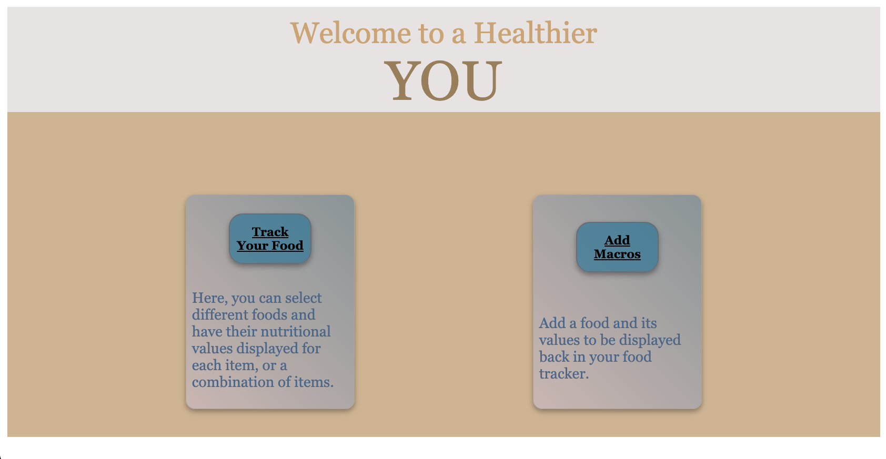
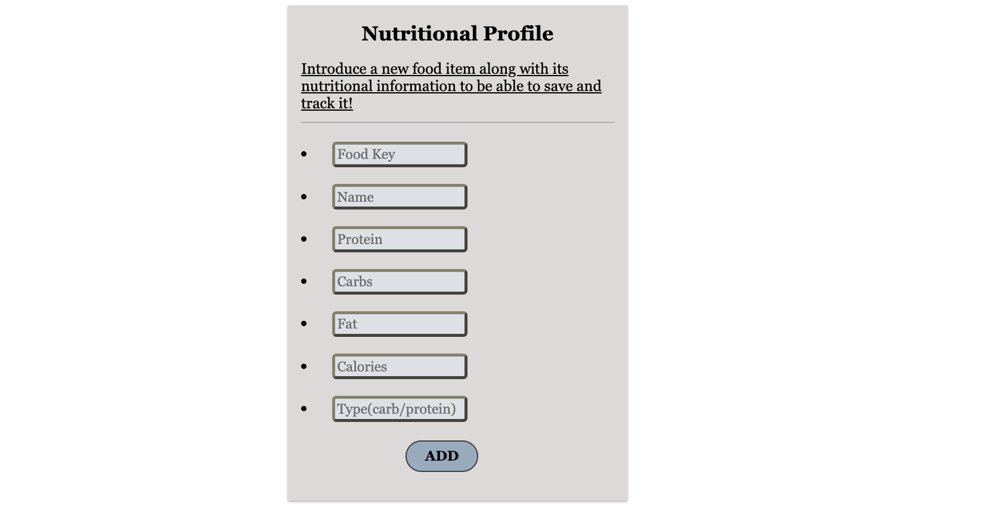
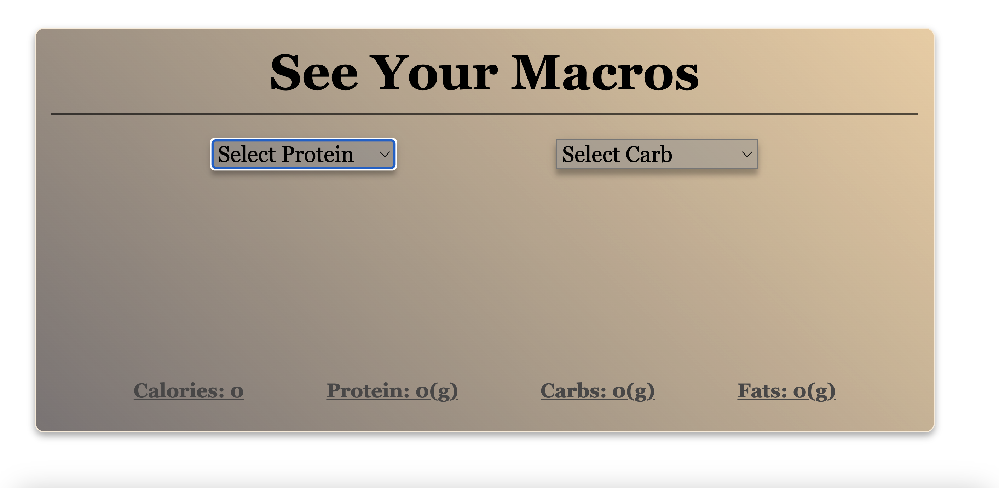

# health-app

I have created a health app that can take foods and their nutitional values to be able to track their calories, fats, carbs, and protein. This app also interacts with a database and can add information to it, to be able to track other foods. 

*This is a full stack app*
*You may see extra folders that aren't used yet. These for are for the progression of the app.*

